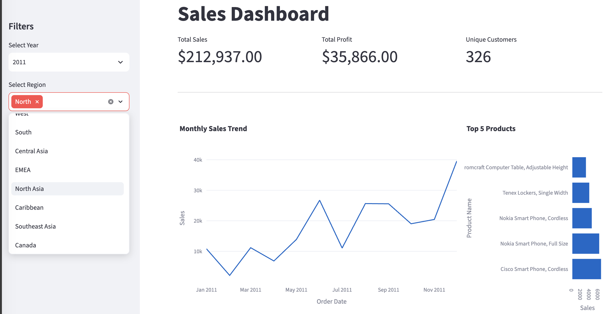
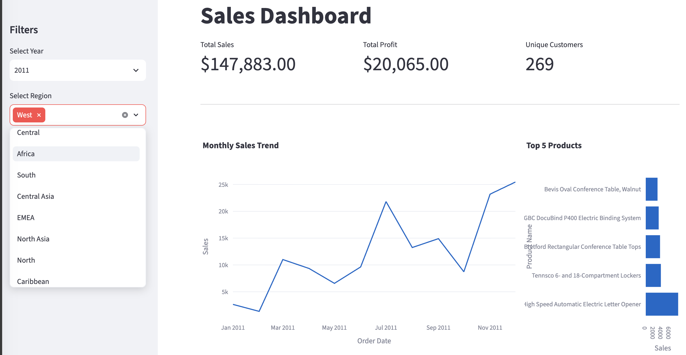

# Streamlit Deployment Dashboard

A practice Streamlit project that showcases sales, profits, and customer metrics.

The dashboard visualizes data that has been ingested from Google Drive, transformed using AWS Glue and PySpark, and stored in Amazon S3 as curated Parquet datasets.

Users can:

- Select a year.
- Select one of twelve regions.
- View Total Sales, Total Profit, and Unique Customers.
- Explore monthly sales trends.
- View the top five products for the selected region.

## Architecture

Google Drive
      │
      ▼
Amazon S3 (Raw)
      │
      ▼
AWS Glue ETL (PySpark)
      │
      ▼
Amazon S3 (Curated Parquet)
      │
      ▼
Streamlit Dashboard
      │
      ▼
Public Web App

## Technologies Used

- Google Drive API
- AWS Glue
- AWS Glue Data Catalog
- Amazon S3
- PySpark
- Streamlit
- GitHub

## Screenshots

## Live Demo

https://appdeploy-wn2sxq6jwccmpcpzb9w6ve.streamlit.app/

## Running the Project

Open the live demo URL in a web browser. Use the Year and Region filters in the left sidebar to interact with the dashboard.